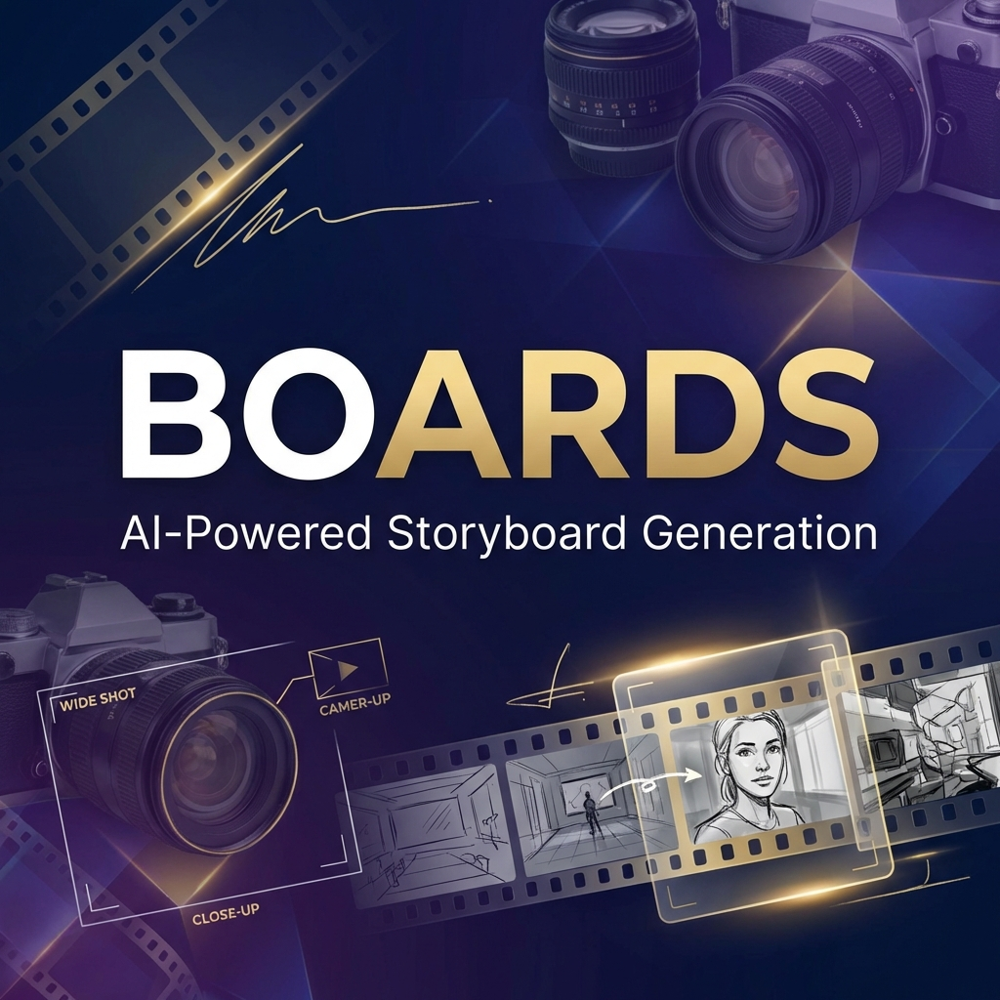
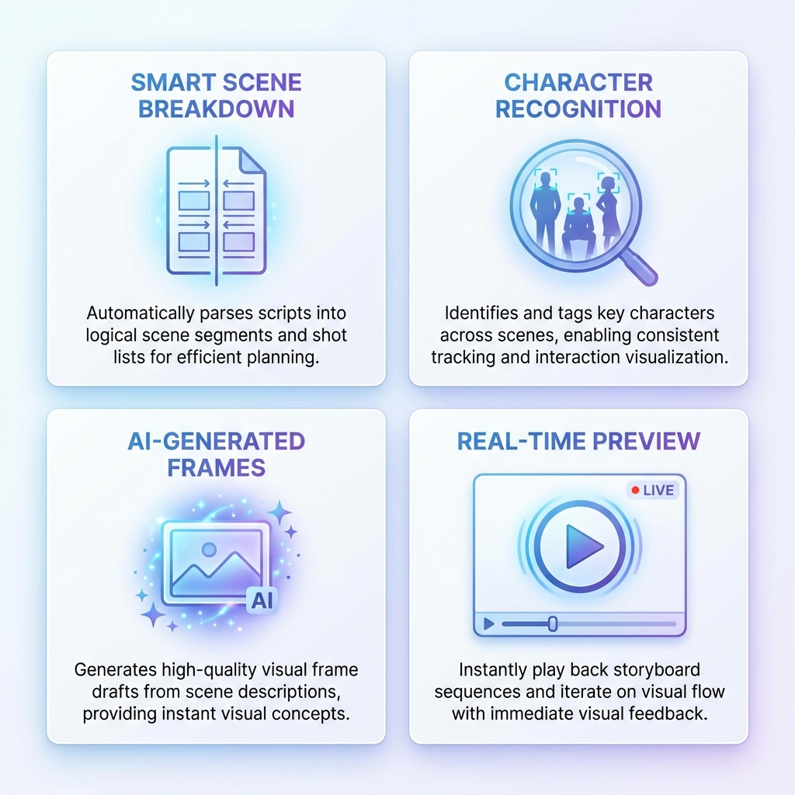
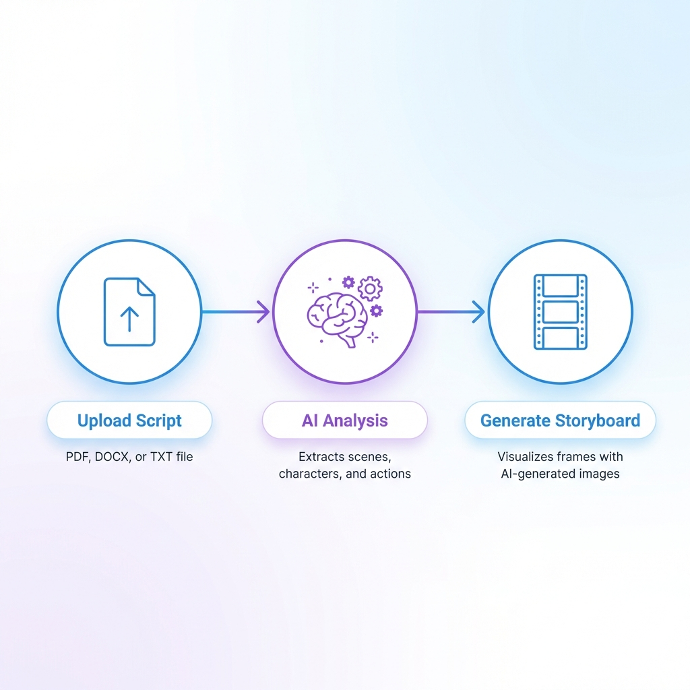

<div align="center">



# 🎬 Boards

### AI-Powered Storyboard Generation for Filmmakers & Creators

[](https://opensource.org/licenses/MIT)
[](https://reactjs.org/)
[](https://www.typescriptlang.org/)
[](https://vitejs.dev/)
[](https://ai.google.dev/)

[✨ Features](#-features) • [🚀 Quick Start](#-quick-start) • [📖 Documentation](#-documentation) • [🤝 Contributing](#-contributing)

</div>

---

## 🎯 What is Boards?

**Boards** is a revolutionary storyboarding tool that transforms your scripts and story ideas into professional visual storyboards using cutting-edge AI technology. Powered by Google's Gemini AI, Boards automates the tedious process of scene breakdown, character identification, and frame generation—letting you focus on your creative vision.

### Why Boards?

- ⚡ **10x Faster** - Generate complete storyboards in minutes, not hours
- 🎨 **AI-Powered** - Intelligent scene analysis and automatic frame generation
- 🎬 **Professional** - Industry-standard shot types, camera angles, and compositions
- 🔄 **Iterative** - Real-time editing and regeneration
- 📱 **Modern** - Clean, intuitive interface built with React & TypeScript

---

## 🌟 Features

<div align="center">



</div>

### 🧠 Smart Scene Breakdown
Automatically parses scripts into logical scene segments and shot lists for efficient planning. Supports PDF, DOCX, TXT, and Fountain formats.

### 👥 Character Recognition
Identifies and tags key characters across scenes, enabling consistent tracking and interaction visualization throughout your storyboard.

### 🎨 AI-Generated Frames
Generates high-quality visual frame drafts from scene descriptions using Google Gemini, providing instant visual concepts for every shot.

### ⚡ Real-Time Preview
Instantly play back storyboard sequences and iterate on visual flow with immediate visual feedback—no waiting, no rendering.

---

## 🔄 How It Works

<div align="center">



</div>

### Simple 3-Step Process:

1. **📄 Upload Your Script** - Drop in your screenplay, treatment, or story outline (PDF, DOCX, TXT, Fountain)
2. **🤖 AI Analysis** - Gemini AI extracts scenes, characters, and actions automatically
3. **🎬 Generate Storyboard** - Get professional storyboard frames with camera angles and compositions

---

## 🚀 Quick Start

### Prerequisites

- Node.js 18+ and npm
- Google Gemini API key ([Get one here](https://ai.google.dev/))

### Installation

```bash
# Clone the repository
git clone https://github.com/thesohamdatta/Boards.git
cd Boards

# Install dependencies
npm install

# Create environment file
cp .env.example .env

# Add your Gemini API key to .env
VITE_GEMINI_API_KEY=your_api_key_here

# Start development server
npm run dev
```

The app will open at `http://localhost:5173`

### Build for Production

```bash
npm run build
npm run preview
```

---

## 📖 Documentation

### Project Structure

```
boards/
├── src/
│   ├── components/        # React components
│   │   ├── layout/       # App layout (Sidebar, TopBar)
│   │   ├── storyboard/   # Storyboard grid, panels, timeline
│   │   ├── wizard/       # Project creation wizard
│   │   └── modals/       # Settings, character editor
│   ├── lib/              # Core logic
│   │   ├── gemini-client.ts      # Production-grade Gemini API client
│   │   ├── script-parser.ts      # Script parsing & validation
│   │   ├── image-generator.ts    # SVG storyboard generation
│   │   └── api.ts                # Main API integration
│   ├── stores/           # Zustand state management
│   ├── types/            # TypeScript definitions
│   └── pages/            # Route pages
├── assets/               # README images
└── docs/                 # Additional documentation
```

### Key Technologies

- **Frontend**: React 18, TypeScript, Vite
- **UI**: Radix UI, Tailwind CSS, Shadcn/ui
- **AI**: Google Gemini 2.5 Flash
- **State**: Zustand with persistence
- **Routing**: React Router v7
- **File Parsing**: PDF.js for script uploads

---

## 🎨 Features in Detail

### 📝 Script Parsing

Boards intelligently parses your screenplay using advanced AI:

- **Format Support**: PDF, DOCX, TXT, Markdown, Fountain
- **Scene Detection**: Automatic scene heading recognition
- **Character Extraction**: Identifies speaking characters and descriptions
- **Action Analysis**: Breaks down scene actions into shot opportunities

### 🎬 Storyboard Generation

Generate professional storyboard frames with:

- **Camera Angles**: Wide, Medium, Close-Up, Over-Shoulder, High/Low Angle
- **Shot Types**: Establishing, Action, Reaction, Detail shots
- **Compositions**: Rule of thirds, leading lines, depth
- **Styles**: Sketch, Clean Line, Detailed, Minimalist

### 🔧 Advanced Settings

- **AI Model Selection**: Choose between Gemini 2.5 Flash, 2.0 Flash, or Lite
- **Image Styles**: Customize visual aesthetic
- **Aspect Ratios**: 16:9, 4:3, 2.39:1 (Cinemascope)
- **Export Options**: PDF, JSON, CSV shot lists

---

## 🛡️ Production-Grade AI Integration

Boards features a **hardened, production-ready Gemini integration** with:

✅ **Comprehensive Error Handling** - Graceful degradation, never crashes  
✅ **Automatic Retries** - Smart fallback across multiple AI models  
✅ **Timeout Protection** - 45-second request limits  
✅ **Rate Limit Handling** - Automatic backoff and retry  
✅ **Input Validation** - Script length and content checks  
✅ **Structured Logging** - Full request/response observability  
✅ **User-Friendly Errors** - Clear, actionable error messages  

See [GEMINI-INTEGRATION-REPORT.md](./GEMINI-INTEGRATION-REPORT.md) for technical details.

---

## 🤝 Contributing

We welcome contributions! Here's how you can help:

1. **Fork** the repository
2. **Create** a feature branch (`git checkout -b feature/amazing-feature`)
3. **Commit** your changes (`git commit -m 'Add amazing feature'`)
4. **Push** to the branch (`git push origin feature/amazing-feature`)
5. **Open** a Pull Request

### Development Guidelines

- Follow existing code style (TypeScript, ESLint)
- Write meaningful commit messages
- Add tests for new features
- Update documentation as needed

---

## 📋 Roadmap

- [ ] **Animatic Export** - Generate video previews with timing
- [ ] **Collaboration** - Multi-user project editing
- [ ] **Cloud Storage** - Supabase integration for project sync
- [ ] **Advanced AI** - Shot composition suggestions
- [ ] **Mobile App** - iOS/Android companion apps
- [ ] **Plugin System** - Extend with custom AI models

---

## 🐛 Known Issues

- TypeScript type narrowing warnings (non-blocking)
- Large scripts (>50 pages) may need truncation
- SVG generation quality varies by complexity

See [Issues](https://github.com/thesohamdatta/Boards/issues) for full list.

---

## 📄 License

This project is licensed under the **MIT License** - see the [LICENSE](LICENSE) file for details.

---

## 🙏 Acknowledgments

- **Google Gemini** - For powerful AI capabilities
- **Radix UI** - For accessible component primitives
- **Shadcn/ui** - For beautiful UI components
- **Vite** - For blazing-fast development experience

---

## 📧 Contact

**Soham Datta** - [@thesohamdatta](https://github.com/thesohamdatta)

Project Link: [https://github.com/thesohamdatta/Boards](https://github.com/thesohamdatta/Boards)

---

<div align="center">

### ⭐ Star this repo if you find it useful!

**Made with ❤️ by filmmakers, for filmmakers**

[Report Bug](https://github.com/thesohamdatta/Boards/issues) • [Request Feature](https://github.com/thesohamdatta/Boards/issues) • [Documentation](./docs)

</div>
